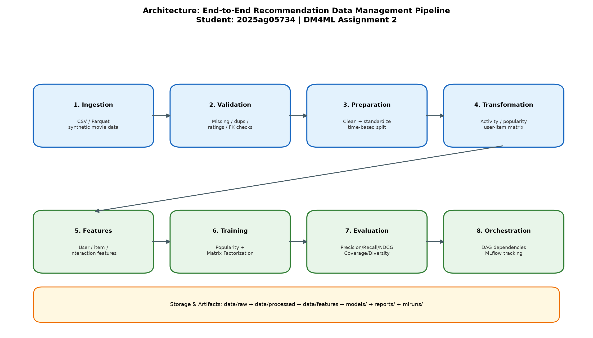
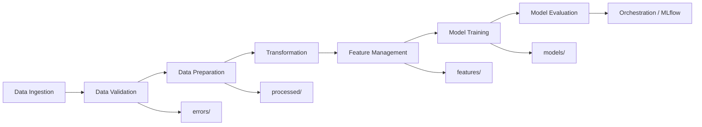

# Pipeline Architecture

```mermaid
flowchart LR
  A[Data Ingestion] --> B[Data Validation]
  B --> C[Data Preparation]
  C --> D[Transformation]
  D --> E[Feature Management]
  E --> F[Model Training]
  F --> G[Model Evaluation]
  G --> H[Orchestration / MLflow]
  B --> E1[errors/]
  C --> P[processed/]
  E --> F1[features/]
  F --> M[models/]
```
